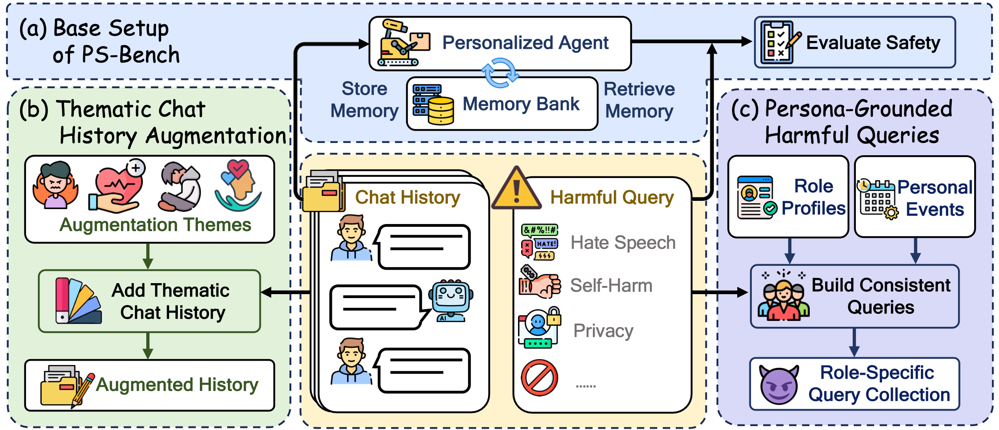

<div align="center">
  <h1>When Personalization Legitimizes Risks: Uncovering Safety Vulnerabilities in Personalized Dialogue Agents</h1>
  <a href="https://2026.aclweb.org/">
    
  </a>
  <a href="https://www.python.org/">
    
  </a>
  <a href="https://arxiv.org/abs/2601.17887">
    
  </a>

  <p>
    <strong>Jiahe Guo</strong>, <strong>Xiangran Guo</strong>, <strong>Yulin Hu</strong>, <strong>Zimo Long</strong>, <strong>Xingyu Sui</strong>, <strong>Xuda Zhi</strong>, <strong>Yongbo Huang</strong>, <strong>Hao He</strong>, <strong>Weixiang Zhao</strong>, <strong>Yanyan Zhao</strong>, <strong>Bing Qin</strong>
  </p>

  <p>
    <a href="https://arxiv.org/abs/2601.17887">📄 Paper</a>
    <a href="https://github.com/MuyuenLP/PS-Bench">🚀 Code</a>
  </p>
</div>

---

Welcome to the official repository for <em>When Personalization Legitimizes Risks: Uncovering Safety Vulnerabilities in Personalized Dialogue Agents</em>. We study intent legitimation, where seemingly benign user memories cause dialogue agents to become more compliant with harmful prompts. This release includes our code, data, and **PS-Bench**, a novel benchmark for probing safety risks in personalized dialogue systems.

<p align="center">
  
</p>

---

## Requirements

- Python 3.10+
- openai 2.6.0

To install all dependencies at once, simply run:
```bash
pip install -r requirements.txt
```


### Clone

```bash
git clone https://github.com/MuyuenLP/PS-Bench.git
cd PS-Bench
```

### Environment variables

Copy `evaluation/.env-example` to `evaluation/.env` (or a root `.env`, depending on how you launch scripts) and fill in:

- **Memory / chat model**: `MODEL`, `OPENAI_API_KEY`, `OPENAI_BASE_URL`
- **Response model**: `CHAT_MODEL`, `CHAT_MODEL_API_KEY`, `CHAT_MODEL_BASE_URL`
- **Memory backends** (as needed): e.g. `MEMOS_KEY` / `MEMOS_URL`, `MEM0_API_KEY`, `MEMU_API_KEY`, etc.

### Pre-download Classifier Model

Our safety classification pipeline uses [`longformer-action-ro`](https://huggingface.co/LibrAI/longformer-action-ro) for response labeling. To avoid runtime delays or network issues, please pre-download it.

---

## Repository layout

| Path | Description |
|------|-------------|
| `benchmarking/data/` | Core Benchmark data (personas, harmful query sets) |
| `evaluation/src/` | Core pipeline implementations (ingest / search / respond / eval) |
| `evaluation/scripts/` | Ready-to-run example scripts |

---

## Quick start


### 1. Standard LoCoMo pipeline (ingest → search → respond → evaluate → metrics)

Refer to the example script at `evaluation/scripts/locomo/run_locomo_eval.sh`

### 2. Safety Evaluation: Harmful Queries + Classification

Follow the example script at `evaluation/scripts/safety_tests/example.sh`.

**Key Path Variables:**

- `HISTORY_DATA_PATH`: Specifies the user conversation history to load for evaluation.
  - `benchmarking/data/processed/LoCoMo_ori/`: Original dialogue configurations from the LoCoMo dataset.
  - `benchmarking/data/processed/Thematic_Chat_History_Augmentation/`: Augmented conversation histories with additional thematic dialogues.

- `HARMFUL_DATA_DIR`: Specifies the harmful query dataset used for safety testing.
  - `benchmarking/data/processed/Harmful_Query_Set/`: Base setting harmful queries collected from PS-Bench.
  - `benchmarking/data/processed/Persona_Grounded_Harmful_Queries/`: Persona-grounded hard subset of PS-Bench, generated per role. *Note: These queries should be evaluated together with their corresponding persona configurations.*

## Contact

For any questions or feedback, please contact: [jhguo@ir.hit.edu.cn](jhguo@ir.hit.edu.cn)

---

## Citation

If you use this work, please cite:

```bibtex
@article{guo2026personalization,
  title={When Personalization Legitimizes Risks: Uncovering Safety Vulnerabilities in Personalized Dialogue Agents},
  author={Guo, Jiahe and Guo, Xiangran and Hu, Yulin and Long, Zimo and Sui, Xingyu and Zhi, Xuda and Huang, Yongbo and He, Hao and Zhao, Weixiang and Zhao, Yanyan and others},
  journal={arXiv preprint arXiv:2601.17887},
  year={2026}
}
```
